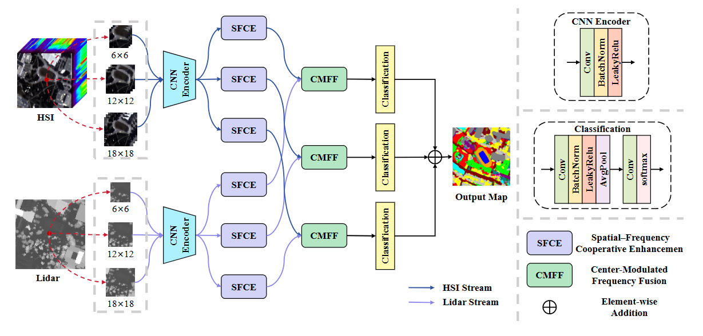

# SFCM-Net

 

Our model was trained on an NVIDIA NVIDIA RTX 4090 GPU.

    

## 👉 Data

We conducted 10 distinct data partitions based on [IF_CALC](https://github.com/Ding-Kexin/IF_CALC/blob/main/Model/index_2_data.py) implementation and adopted the average results across these iterations as the final reported outcomes in our study.

* [Houston](https://hyperspectral.ee.uh.edu/)

* [MUUFL](https://github.com/GatorSense/MUUFLGulfport/)

* [Trento](https://github.com/danfenghong/IEEE_GRSL_EndNet/blob/master/README.md)

## 🌈 Results

| Dataset  | OA (%) | AA (%) | Kappa (%) |
|----------|--------|--------|-----------|
| Houston    | 95.85 |  96.41 |    95.51  |
| MUUFL   | 86.76 |  85.60 |    82.81  |
| Trento  | 99.57 |  99.13 |    99.43  |

## 🌿 Getting Started

### Environment Setup

To get started, we recommend setting up a conda environment and installing dependencies via pip. Use the following commands to set up your environment.
    
    conda create -n sfcmnet python==3.9
    
    conda activate sfcmnet
    
    pip install -r requirements.txt

### Train and Test
    python demo.py

### Citation
If this code is useful for your research, please cite this paper.

## 🌸 Acknowledgment

We are deeply grateful to repositories [IF_CALC](https://github.com/Ding-Kexin/IF_CALC), [GLT](https://github.com/Ding-Kexin/IEEE_TGRS_GLT-Net) and [FDNet](https://github.com/RSIP-NJUPT/FDNet.git), which served as the foundational basis for our code implementation.
